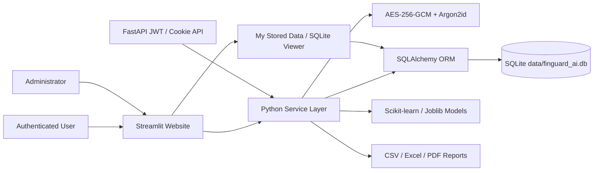

# System Architecture

SQLite runs in WAL mode with foreign keys, indexes, constraints, busy timeout and transaction rollback. Sensitive values are encrypted before SQLAlchemy writes them to SQLite.
