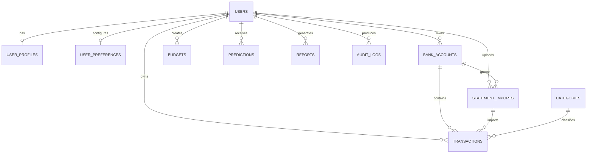

# Database ER Diagram

Sensitive values are stored in AES-256-GCM encrypted text columns. Last-four digits and deterministic hashes support masking and duplicate checks without displaying original identifiers. Foreign keys use cascade or set-null behaviour to preserve relational integrity.
