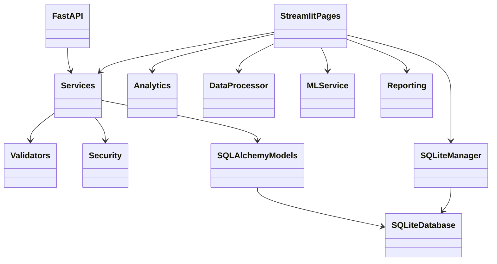
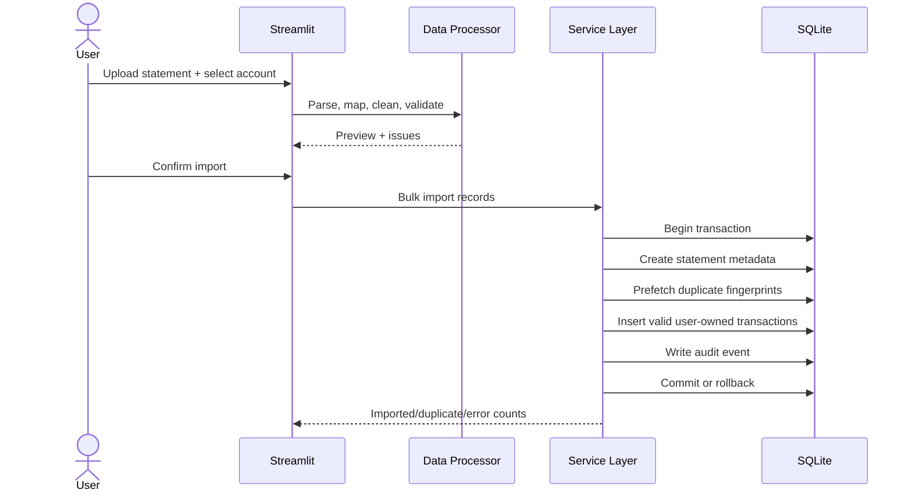
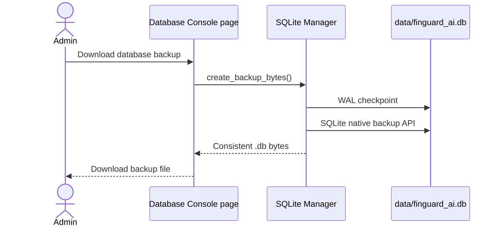

# UML Diagrams

## Component diagram

```mermaid
classDiagram
  class StreamlitPages
  class FastAPI
  class Services
  class Validators
  class Security
  class Analytics
  class DataProcessor
  class MLService
  class Reporting
  class SQLiteManager
  class SQLAlchemyModels
  class SQLiteDatabase
  StreamlitPages --> Services
  FastAPI --> Services
  Services --> Validators
  Services --> Security
  Services --> SQLAlchemyModels
  StreamlitPages --> Analytics
  StreamlitPages --> DataProcessor
  StreamlitPages --> MLService
  StreamlitPages --> Reporting
  StreamlitPages --> SQLiteManager
  SQLiteManager --> SQLiteDatabase
  SQLAlchemyModels --> SQLiteDatabase
```

## Statement import sequence

```mermaid
sequenceDiagram
  actor User
  participant UI as Streamlit
  participant DP as Data Processor
  participant S as Service Layer
  participant DB as SQLite
  User->>UI: Upload statement + select account
  UI->>DP: Parse, map, clean, validate
  DP-->>UI: Preview + issues
  User->>UI: Confirm import
  UI->>S: Bulk import records
  S->>DB: Begin transaction
  S->>DB: Create statement metadata
  S->>DB: Prefetch duplicate fingerprints
  S->>DB: Insert valid user-owned transactions
  S->>DB: Write audit event
  S->>DB: Commit or rollback
  S-->>UI: Imported/duplicate/error counts
```

## Backup sequence

```mermaid
sequenceDiagram
  actor Admin
  participant UI as Database Console page
  participant SM as SQLite Manager
  participant DB as data/finguard_ai.db
  Admin->>UI: Download database backup
  UI->>SM: create_backup_bytes()
  SM->>DB: WAL checkpoint
  SM->>DB: SQLite native backup API
  SM-->>UI: Consistent .db bytes
  UI-->>Admin: Download backup file
```
